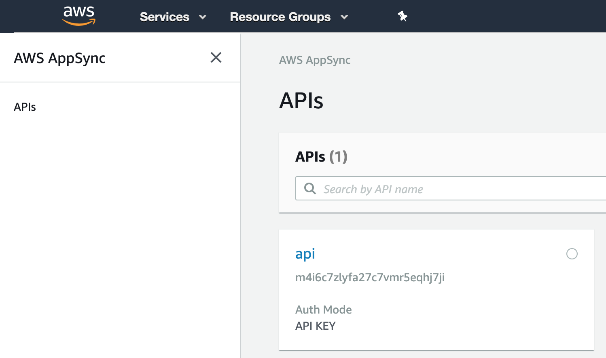
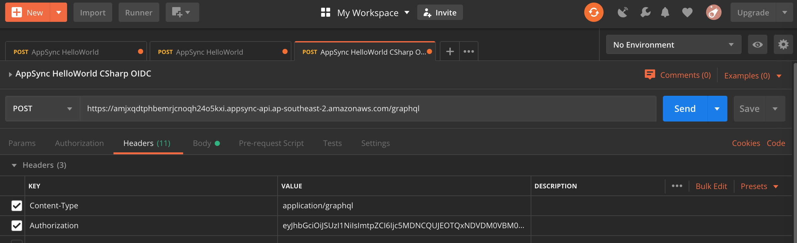
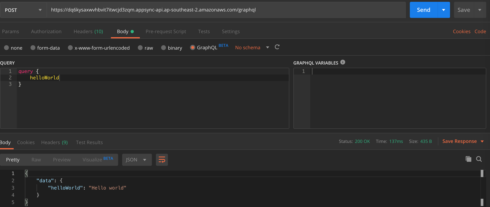

# Serverless AppSync OIDC
> A quick example of how to setup AWS AppSync with Dotnet Core Lambda Resolvers using Open Id Connect (OIDC) authorization

## General info
I started investigating how to use AWS AppSync for one of my work projects, but found the examples online were either overly complex or didn't show how to connect to an OIDC authorizer such as Identity Server 4.
This repo therefore is a stripped down HelloWorld solution which shows just what you need to use AppSync + Lambdas + OIDC.

## Prerequisites

You will need an AWS account with the AWS cli installed and working

## Setup

1. Clone the repo
2. [Install Serverless](https://serverless.com/framework/docs/getting-started/) if you haven't already got it setup locally
```sh
npm install -g serverless
```
3. A plugin that is used, [Serverless AppSync Plugin](https://github.com/sid88in/serverless-appsync-plugin), needs to be installed via npm:
```sh
    npm install
```
4. Set the url of your OIDC provider by updating "https://issuer_goes_here.com" in the serverless.yml file
5. Build the dotnet core code
```sh
    ./build.sh
```
6. Deploy
```sh
    sls deploy
```
All going well the deployment will success and you'll get back the Service Information


```sh
Service Information
service: myappsynctest
stage: dev
region: ap-southeast-2
stack: myappsynctest-dev
resources: 14
api keys:
   None
appsync api keys:
   None
endpoints:
   None
appsync endpoints:
   https://dq6kysaxwvhbvit7itwcjd3zqm.appsync-api.ap-southeast-2.amazonaws.com/graphql
functions:
   graphql: myappsynctest-dev-graphql
```

Be sure to take note of the appsync endpoint. You'll need it later.
The deployment will create an AppSync api within your AWS account:


## Once deployed, how to use?

1. Open [Postman](https://www.getpostman.com/)

2. Set the following headers:

| Header  | Value |
| ------------- | ------------- |
| Content-Type  | application/graphql |
| Authorization | Put your jwt access token here. No need for "Bearer ". |



3. HTTP Verb: POST

4. In the Body tab, select GraphQL and set the following body:
```javascript
query {helloWorld}
```

5. Enter the appsync endpoint from the deploy step above as the request url

6. Hit send. All going well you'll get back a Hello World response
